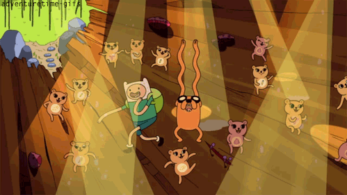
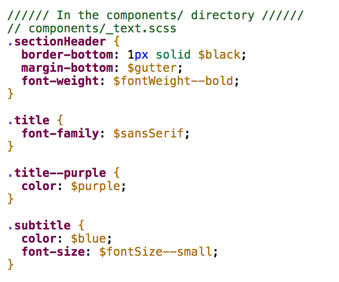

# [fit] Delightful
# [fit] **Stylesheets**

---

# [fit] ''CSS is **hard**''
#### - me, many times
#### - also, the internet

^ no error reporting
^ browser compatibility
^ specificity

---

## ~~CSS is hard~~
### [fit] **but it doesn't have to be**

---

# **The Cascade**

### (it's a feature, not a 🐞)

^ CSS is doing exactly what it was meant to do
make the cascade work for you, don't fight against it

---

### **The cascade**
## **1.** Source Order
## **2.** Specificity
## **3.** Importance

---

### The cascade
## **1. Source Order**
## **2.** Specificity
## **3.** Importance


^ elements within same file, but also the order in which files are included

---

### The cascade
## **1.** Source Order
## **2. Specificity**
## **3.** Importance


^ certain selectors will override others

---

### The cascade
## **1.** Source Order
## **2. Specificity**
## **3.** Importance


---

### The cascade
## **1.** Source Order
## **2.** Specificity
## **3. Importance**


^ if you do end up with the exact same specificity and importance,
source order wins out

---


# [fit] !important

^ overrides all source order and specifity
throws our our capability to write clean and predictable CSS
makes things super hard to change later
yes it makes things work, but it causes a lot more work to get around it in the future

---

### The cascade
## 1. **Source Order**
## 2. **Specificity**
## 3. **Importance**

^ so that's the cascase, the thing that makes css css
^ bad css happens when we ignore the cascade and the rules of css
^ this makes your codebase not predictable, scalable or maintainable
costs more to update, both in money and time and headaches

---

### _So what now?_
### **What can we do to save us from ourselves?**


^ so what now? What can we do to save us from ourselves?

---

# [fit] _Organization_ **&**
# [fit] Componentization

---
### **Organization with**
# ITCSS

### *by Harry Roberts*

---

# [fit] **Inverted**
# [fit] *Triangle*
# [fit] CSS

^ a way to organize your css so that the cascade works for you
ITCSS can be used with or without preprocessors and
is compatible with CSS methodologies like BEM, SMACSS or OOCSS.

---

# [fit] **Philosophy**
# [fit] NOT *A*
# [fit] *Framework*

^ no code to download, just simply a way of thinking differently

---


---


^ we break up the triangle in to separate layers

---


## **Variables**

## contain fonts, colors, measurements, etc

^ only needed when using CSS preprocessors like SCSS or Less

---


## **Tools**
## globally used mixins and functions

^ also optional - only needed when using preprocessors

---


## **General**
## reset and/or normalize styles, box-sizing definition

^ This is the first layer which generates actual CSS

---


## **Base Elements**
## styling for HTML elements
## ``` h1, a, p, input```

---


## **Components**
## specific components unique to the design
## ```.panel, .form ```

^ this is where the majority of our work takes place

---


## **Utilities**
## utilities and helper classes with ability to override
## ```.is--hidden```

^ the _only_ place where !important should exist

---


---

# [fit] **What does this buy us?**

---

# [fit] Reusabe & Scalable

---

# [fit] Reduce specificity

---

# [fit] Less waste, smaller files

---


# More **delightful**

---

# [fit] _Organization_ **&**
# [fit] Componentization

---

# [fit] discrete
# [fit] **self-contained**
# [fit] *reusable*

^ discrete, reusable components that are combined to build up different pieces of UI

---


---

## **Set up base styles first**
- fonts
- colors
- sizing & measurements
- layout


---


---


---


---


---

**1. text components** </br>

- section header
- title & subtitle

</br>

**2. entry components**</br>

- entry
- image
- content
- featured entry


---



^ text components

---


^ what page looks like with text components applied

---

Next is the entry components


---


^ entry html
^ talk about BEM a little bit

---


^ entry-scss
^ call out nesting - increases specificity

---


^ what page looks like with entry compoonents applied

---

# **Almost done!**

- Featured entry styling
- Responsiveness


---


^ featured entry scss

---


^ gif of page showing featured & responsive

---

# [fit] _Organization_ **&**
# [fit] Componentization

---


^ less than 15 lines of css specific to the footer

---


---


---


---


---

# *Aly Fluckey*
##  @**wtfluckey**

