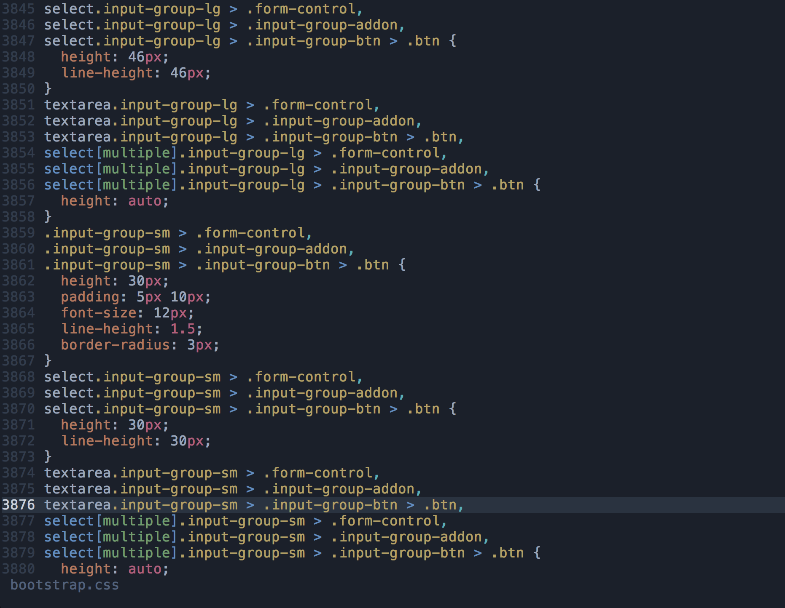
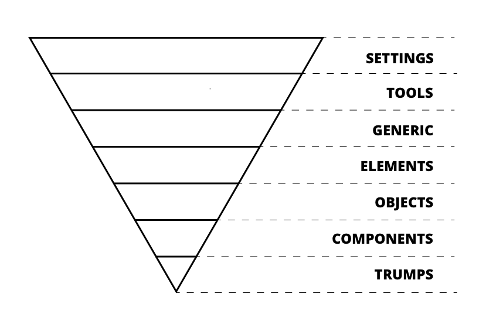
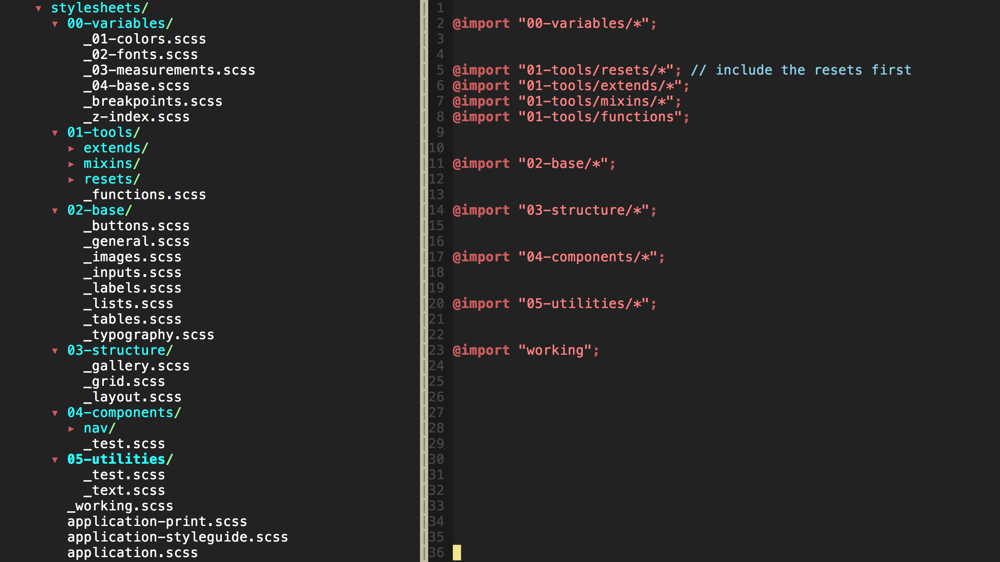
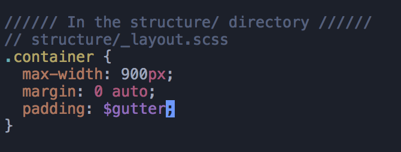
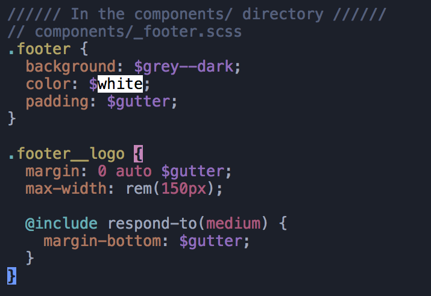
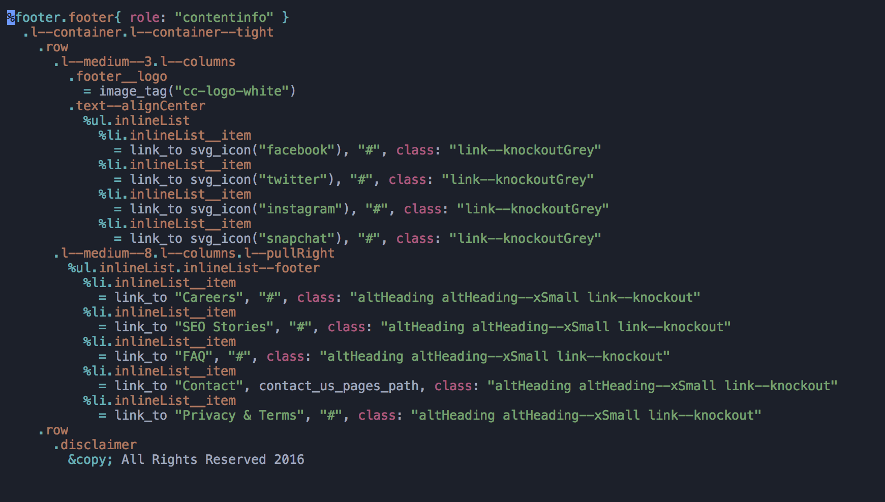

# [fit] Delightful
# [fit] **Stylesheets**

---

## **Aly Fluckey**
### UX Developer

--- 

# [fit] CSS is **hard**

---

- No error reporting
- Browser compatibility
- Specificity
- Necessity

---

## ~~CSS is hard~~
### **but it doesn't have to be**
#### (more on this later)

---

# The Cascade

^ CSS is an acronym of Cascading Style Sheets,
which indicates that the notion of the cascade is important.
At its most basic level it indicates that the order of CSS
rules matter, but it's more complex than that.

---

---

## **1.** Importance
## **2.** Specificity
## **3.** Source Order

---

# [fit] **!important**

---

# [fit] Specificity

^ element selectors, like (h1, p, div) 
have low specificity. 
Class selectors have a higher specificity, 
so will win against element selectors. 
ID selectors have an even higher specificity, 
so will win against class selectors. 
The only way to win against an ID selector 
is to use !important.

---

^ https://developer.mozilla.org/en-US/docs/Learn/CSS/Introduction_to_CSS/Cascade_and_inheritance

---

# Source Order

^As mentioned above, if multiple competing 
selectors have the same importance and 
specificity, the third factor that comes 
into play to help decide which rule wins 
is source order — later rules will win 
over earlier rules.

---

---

# [fit] Specificity Wars

---

---

^ https://jonassebastianohlsson.com/specificity-graph/

---

# [fit] Organization **&**
# [fit] Componentization

---

# [fit] **Philosophy**
# [fit] NOT *A*
# [fit] *Framework*

---

# ITCSS

---

# [fit] **Inverted**
# [fit] *Triangle*
# [fit] CSS

^ ITCSS stands for Inverted Triangle CSS and it helps 
you to organize your project CSS files in such way that 
you can better deal with (not always easy-to-deal with) CSS

^ 
ITCSS can be used with or without preprocessors and
is compatible with CSS methodologies like BEM, SMACSS or OOCSS.

---

^ The major principle of ITCSS is that it separates 
your CSS codebase to several sections (called layers)

---

### **Settings**

## contain fonts, colors, measurements, etc

^ only needed when using CSS preprocessors like SCSS or Less

---

### **Tools**
## globally used mixins and functions

^ also optional - only needed when using preprocessors

---

### **General**
### reset and/or normalize styles, box-sizing definition, etc

^ This is the first layer which generates actual CSS

---

### **Elements**
## styling for bare HTML elements, like H1, A, etc

---

### **Objects**
### class-based selectors which define undecorated design patterns

^ example media object known from OOCSS

---

### **Components**
## specific components unique to the design

^ this is where the majority of our work takes place

---

### **Trumps**
## utilities and helper classes with ability to override

^ the _only_ place where !important should exist

---

^ Ordering our projects according to these key metrics has 
several benefits. We can begin to share global and far-reaching
styles much more effectively and efficiently, we vastly reduce 
the likelihood of specificity issues, and we write CSS in a logical
and progressive order. This means greater extensibility and less
redundancy, which in turn means less waste and much smaller file sizes.

---

---

# [fit] Componentization

---

# [fit] discrete
# [fit] **self-contained**
# [fit] *reusable*

^ no longer building using the page model, but building discrete,
reusable components that are combined to build up different pieces of UI

---

---

---

---

---

---

---

---

---

---

---

---

---

---

---

---

# [fit] Pretty **cool**, huh?

---

# [fit] **thank you**

---

# *Aly Fluckey*
##  @**wtfluckey**

