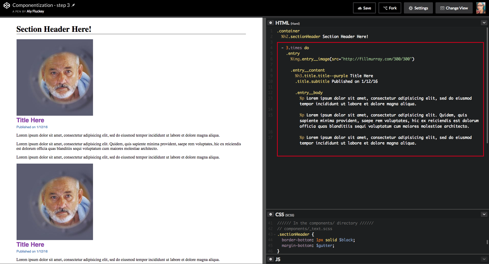

# [fit] Delightful
# [fit] **Stylesheets**

---

# [fit] ''CSS is **hard**''
#### - me, many times
#### - also, the internet

---

## **No error reporting**

^ by nature, css doesn't have a way to tell you when you've messed up

---

## **Browser Compatibility**

---

## **Specificity**

---

## ~~CSS is hard~~
### [fit] **but it doesn't have to be**

---

# **The Cascade**

### (it's a feature, not a 🐞)

^ You can't talk about specificity without first talking about the cascade.
The cascade is CSS's biggest strength but also its biggest complexity.
The cascade is the thing we end up debugging.

---

### **The cascade**
## **1.** Source Order
## **2.** Specificity
## **3.** Importance

---

### The cascade
## **1. Source Order**
## **2.** Specificity
## **3.** Importance


^ elements within same file, but also the order in which files are included

---

### The cascade
## **1.** Source Order
## **2. Specificity**
## **3.** Importance


^ certain selectors will override others

---

### The cascade
## **1.** Source Order
## **2. Specificity**
## **3.** Importance


---

### The cascade
## **1.** Source Order
## **2.** Specificity
## **3. Importance**


^ if you do end up with the exact same specificity and importance,
source order wins out

---


# [fit] !important

^ !important throws our our capability to write clean and predictable CSS
it overrides all source order and specifity
makes things super hard to change later
yes it makes things work, but it causes a lot more work to get around it in the future
txi code audit example

---

### The cascade
## 1. **Source Order**
## 2. **Specificity**
## 3. **Importance**

^ so that's the cascase, the thing that makes css css
what happens when we don't respect the cascade? specificity wars

---


# [fit] Specificity Wars

^ when your CSS codebase is not predictable, scalable or maintainable
costs more to update, both in money and time and headaches
talk about experience as a rails dev, spent most of my time battling spec. wars

---

# bootstrap


``` css

.table-hover > tbody > tr.danger:hover > th {
  background-color: #ebcccc;
}

```

---

# bootstrap specificity


^ https://jonassebastianohlsson.com/specificity-graph/

^ if you include bootstrap first and add on, you're setting
yourself up for the specificity wars

---

### _So what now?_
### **What can we do to save us from ourselves?**


^ so what now? What can we do to save us from ourselves?

---

# [fit] _Organization_ **&**
# [fit] Componentization

---
### **Organization with**
# ITCSS

### *by Harry Roberts*

---

# [fit] **Inverted**
# [fit] *Triangle*
# [fit] CSS

^ ITCSS stands for Inverted Triangle CSS and it helps 
you to organize your project CSS files in such way that 
you can better deal with (not always easy-to-deal with) CSS

^ 
ITCSS can be used with or without preprocessors and
is compatible with CSS methodologies like BEM, SMACSS or OOCSS.

---

# [fit] **Philosophy**
# [fit] NOT *A*
# [fit] *Framework*

---


---


^ we break up the triangle in to separate layers

---


## **Variables**

## contain fonts, colors, measurements, etc

^ only needed when using CSS preprocessors like SCSS or Less

---


## **Tools**
## globally used mixins and functions

^ also optional - only needed when using preprocessors

---


## **General**
## reset and/or normalize styles, box-sizing definition

^ This is the first layer which generates actual CSS

---


## **Base Elements**
## styling for HTML elements
## ``` h1, a, p, input```

---


## **Components**
## specific components unique to the design
## ```.panel, .form ```

^ this is where the majority of our work takes place

---


## **Utilities**
## utilities and helper classes with ability to override
## ```.is--hidden```

^ the _only_ place where !important should exist

---


---

# [fit] **What does this buy us?**

---

# [fit] Reusabe & Scalable

---

# [fit] Reduce specificity

---

# [fit] Less waste, smaller files

---


# More **delightful**

---

# [fit] _Organization_ **&**
# [fit] Componentization

---

# [fit] discrete
# [fit] **self-contained**
# [fit] *reusable*

^ no longer building using the page model, but building discrete,
reusable components that are combined to build up different pieces of UI

---


---

## **Set up base styles first**
- fonts
- colors
- sizing & measurements
- layout


---


---


---


---


---

**1. text components** </br>

- section header
- title & subtitle

</br>

**2. entry components**</br>

- entry
- image
- content
- featured entry


---


^ text components

---


^ what page looks like with text components applied

---

Next is the entry components



---


^ entry html
^ talk about BEM a little bit

---


^ entry-scss
^ call out nesting - increases specificity

---


^ what page looks like with entry compoonents applied

---

# **Almost done!**

- Featured entry styling
- Responsiveness


---


^ featured entry scss

---


^ gif of page showing featured & responsive

---

# [fit] _Organization_ **&**
# [fit] Componentization

---


^ less than 15 lines of css specific to the footer

---


---


---


---


---

# *Aly Fluckey*
##  @**wtfluckey**

