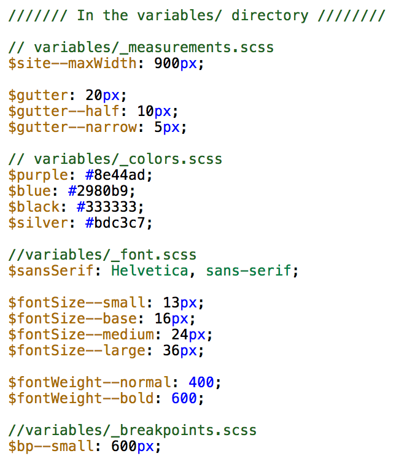
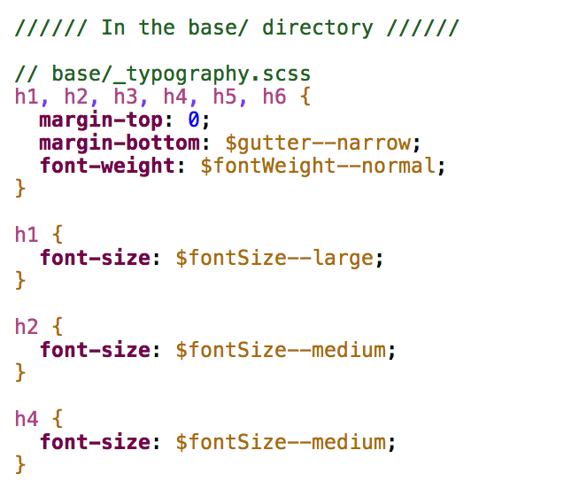
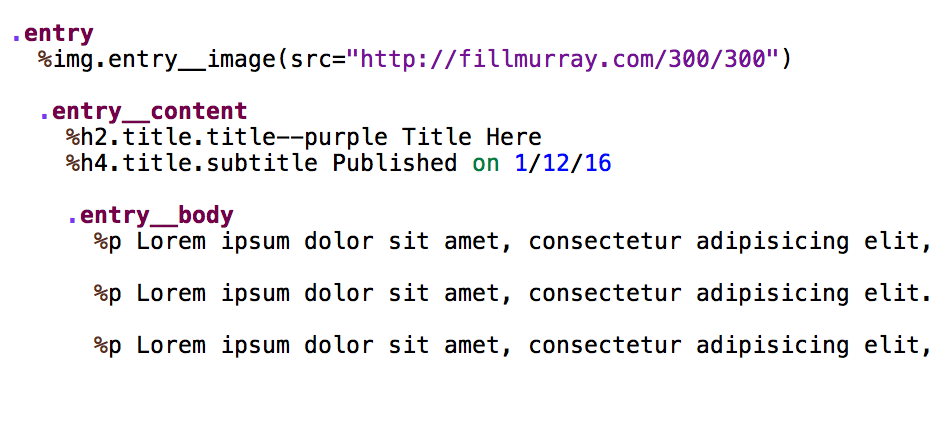
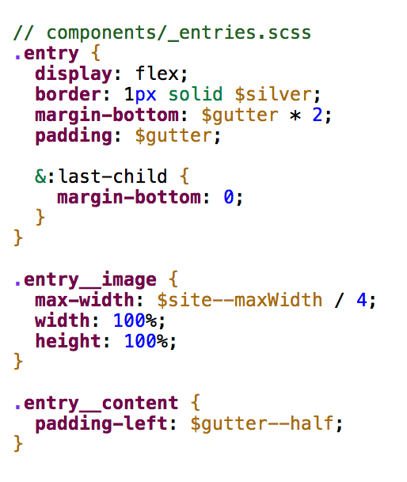

# [fit] Delightful
# [fit] **Stylesheets**

---

# [fit] CSS is **hard**

---

## **No error reporting**

^ by nature, css doesn't have a way to tell you when you've messed up

---

## **Browser Compatibility**

---

## **Specificity**

---

## ~~CSS is hard~~
### [fit] **but it doesn't have to be**

---

# The Cascade

^ You can't talk about specificity without first talking about the cascade.
The cascade is CSS's biggest strength but also its biggest complexity.
The cascade is the thing we end up debugging.

---

## **1. Source Order**
## **2.** Specificity
## **3.** Importance

---


^ elements within same file, but also the order in which files are included

---


---

## **1.** Source Order
## **2. Specificity**
## **3.** Importance

^ certain selectors will override others

---

# [fit] **```IDs```**
# [fit] Classes
# [fit] *Elements*

---


---

## **1.** Source Order
## **2.** Specificity
## **3. Importance**

---


# [fit] !important

^ !important throws our our capability to write clean and predictable CSS
it overrides all source order and specifity
yes it makes things work, but it causes a lot more work to get around it in the future
txi code audit example

---


^ if you do end up with the exact same specificity and importance,
source order wins out

---

# **!important**
### overrides all specificity and source order
### decreases our ability to write clean & predictable CSS

^ makes things super hard to change later

---
# bootstrap


---


^ https://jonassebastianohlsson.com/specificity-graph/

^ if you include bootstrap first and add on, you're setting
yourself up for the specificity wars

---


# [fit] Specificity Wars

^ when your CSS codebase is not predictable, scalable or maintainable
costs more to update, both in money and time and headaches
talk about experience as a rails dev, spent most of my time battling spec. wars

---


---

# [fit] Organization **&**
# [fit] Componentization

---

# ITCSS

### *Harry Roberts*

---

# [fit] **Inverted**
# [fit] *Triangle*
# [fit] CSS

^ ITCSS stands for Inverted Triangle CSS and it helps 
you to organize your project CSS files in such way that 
you can better deal with (not always easy-to-deal with) CSS

^ 
ITCSS can be used with or without preprocessors and
is compatible with CSS methodologies like BEM, SMACSS or OOCSS.

---

# [fit] **Philosophy**
# [fit] NOT *A*
# [fit] *Framework*

---


---


^ we break up the triangle in to separate layers

---


## **Variables**

## contain fonts, colors, measurements, etc

^ only needed when using CSS preprocessors like SCSS or Less

---


## **Tools**
## globally used mixins and functions

^ also optional - only needed when using preprocessors

---


## **General**
## reset and/or normalize styles, box-sizing definition

^ This is the first layer which generates actual CSS

---


## **Base Elements**
## styling for HTML elements
## ``` h1, a, p, input```

---


## **Components**
## specific components unique to the design
## ```.panel, .form ```

^ this is where the majority of our work takes place

---


## **Utilities**
## utilities and helper classes with ability to override
## ```.is--hidden```

^ the _only_ place where !important should exist

---


---

# [fit] **What does this buy us?**

---

# [fit] Reusabe & Scalable

---

# [fit] Reduce specificity

---

# [fit] Less waste, smaller files

---


# [fit] More **delightful**

---

# [fit] Organization &
# [fit] **Componentization**

---

# [fit] discrete
# [fit] **self-contained**
# [fit] *reusable*

^ no longer building using the page model, but building discrete,
reusable components that are combined to build up different pieces of UI

---


---


---



---



---


---


---


---


---


---



^ talk about BEM a little bit

---


---



^ call out nesting - increases specificity

---


---


---


^ less than 15 lines of css specific to the footer

---


---


---


---

# [fit] Organization **&**
# [fit] Componentization

---

# *Aly Fluckey*
##  @**wtfluckey**

